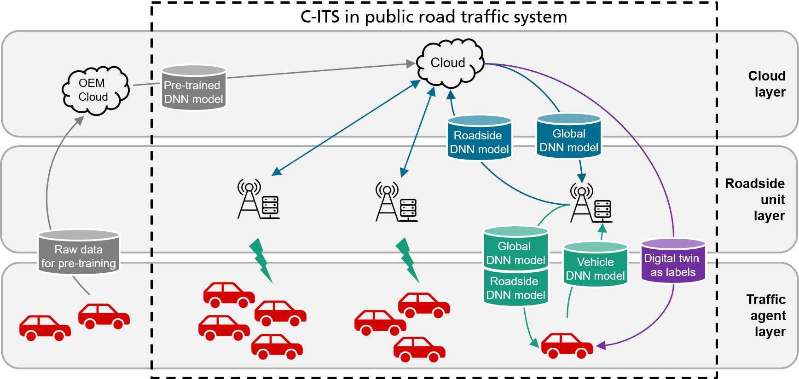
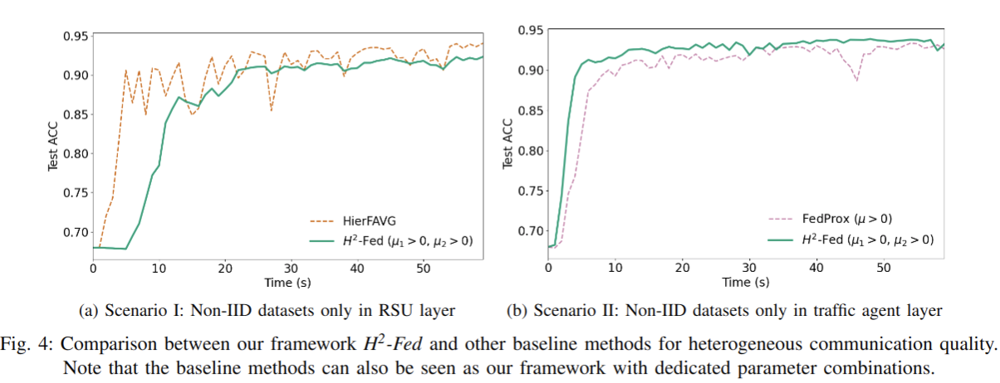

# Federated Learning Framework Coping with Hierarchical Heterogeneity in Cooperative ITS

H2-Fed is a **federated learning framework** addressing hierarchical heterogeneity in the different layers of cooperative Intelligent Transportation Systems (C-ITS).

Even when 90% (CSR=0.1) of the agents are timely disconnected, the pre-trained DNN model can still be forced to converge stably, and its accuracy can be enhanced from 68% to over 90% after convergence.

## Framework Overview

## Example Results on Non-IID MNIST:


## Dependency

 - Python (>=3.7)
 - PyTorch (>=1.9)
 - sklearn (<=0.20)
 - numpy
 - json
 - OpenCV

## Data Preparation

The training parameters can be edited in 'H2-Fed/config/*'

    1. cd H2-Fed/data
    2. python mnist_preparation.py
    The data for train and test will be saved in 'data/mnist/'

## Training Procedures

### Example I: FL with individual parameter set
    1. cd H2-Fed
    2. python  main.py \
       -g 60 \
       -l 5 \
       -c 0.1 \
       -s 1 \
       -f 1 \
       -m 0.001 0.001 \
       -ei 10 10 \
       -rd 'rsu_config_NonIID_RSU' \
       -rc 'rsu_config_NonIID_RSU' \
       -la 'H2Fed' \
       -sm True \
       -bt True \
       -pt True \
       -rr 'results' 

### Example II: Batch FL
    1. cd H2-Fed/config
    2. python main.py \
       -rd 'results' \
       -b True
    Edit the training parameters in 'H2-Fed/config/batch_sim_config.py'


### Explanations of arguments:
- `--GAR` `-g`: Global Aggregation Round
- `--LAR` `-l`: Local Aggregation Round
- `--CSR` `-c`: Connection Success Ratio
- `--SCD` `-s`: Stable Connection Duration
- `--FSR` `-f`: Full-task Success Ratio
- `--mu` `-m`: Core parameters M in framework
- `--epoch_init` `-ei`: Init epoch wrt. FSR
- `--res_dir` `-rd`: Directory of results under root directory
- `--rsu_config` `-rc`: RSU configuration dict data in ./config/*
- `--label` `-la`: Label for result data
- `--batch` `-b`: True, if the existing scenarios are batched run
- `--save_model` `-sm`: True, if the model should be saved
- `--base_train` `-bt`: True, if the centralized training should be implemented first
- `--pre_train` `-pt`: True, if the pre-training should be implemented first
- `--res_root` `-rr`: Root directory of the results


## Evaluation procedures

    1. cd H2-Fed/post_processing
    2. python main_plot.py

## Citation

If you find this work is useful, please cite our paper:
```
@INPROCEEDINGS{song2022h2fed,
  author={Song, Rui and Zhou, Liguo and Lakshminarasimhan, Venkatnarayanan and Festag, Andreas and Knoll, Alois},
  booktitle={2022 IEEE 25th International Conference on Intelligent Transportation Systems (ITSC)}, 
  title={Federated Learning Framework Coping with Hierarchical Heterogeneity in Cooperative ITS}, 
  year={2022},
  pages={3502-3508},
  doi={10.1109/ITSC55140.2022.9922064}}
```

### Authors: 
 - Rui Song ([linkedin](https://www.linkedin.com/in/rui-song-923854112/))
 - Liguo Zhou
 - Venkatnarayanan, Lakshminarasimhan 
 - Prof. Dr.-Ing. Andreas Festag ([linkedin](https://www.linkedin.com/in/andreas-festag-97b7011/), [web](https://festag-net.de/))
 - Prof. Dr.-Ing. habil. Alois C. Knoll ([linkedin](https://www.linkedin.com/in/alois-knoll-505480166/), [web](https://www.in.tum.de/en/i06/people/prof-dr-ing-habil-alois-knoll/))
